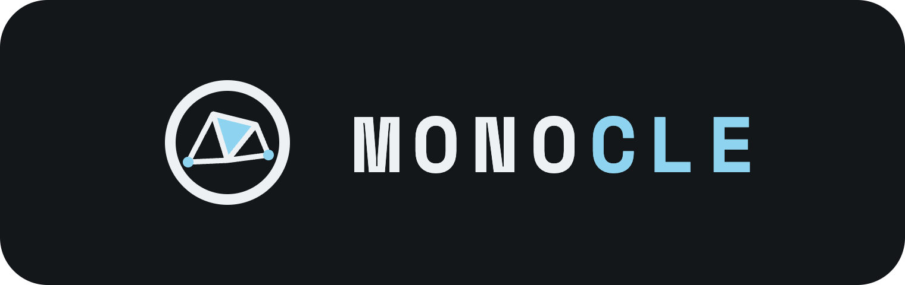
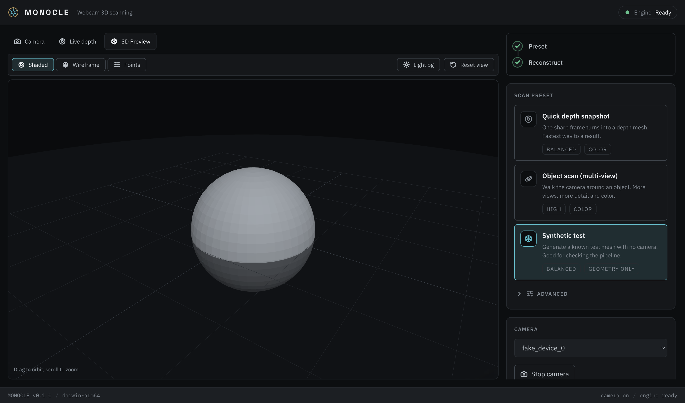
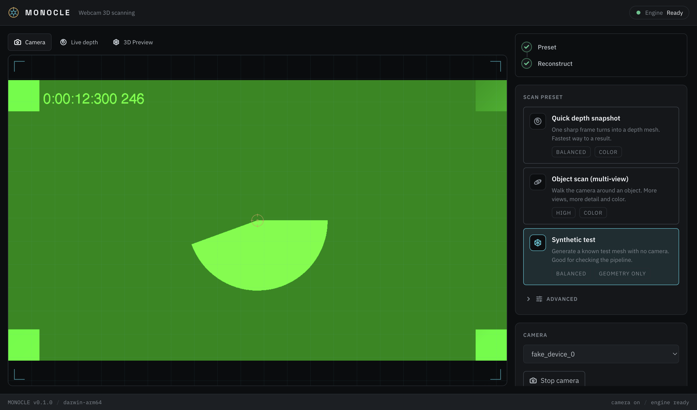

<p align="center"></p>

Webcam-first 3D scanning suite. One ordinary webcam in, a printable mesh out. No
depth sensor, no markers required, everything on-device.



The core experience is markerless: point or move a webcam at an object and
MONOCLE recovers geometry using monocular depth (and, for multi-view, a
feed-forward reconstruction model). It captures color, previews the result in a
real 3D viewport, and exports STL for printing plus color formats. There is also
a live depth preview that runs a depth model in the browser in real time.

## Status

Working, actively developed. Signed and notarized installers are published by CI
on a version tag: macOS (Apple Silicon), Windows, and Linux AppImage
(x64 and arm64/Raspberry Pi). The bundled interpreter runs on macOS 11+ (it ships
the OpenBLAS build of numpy/scipy, not the macOS-14-only Accelerate one). What is
in place:

- Live in-renderer depth preview (onnxruntime-web on WebGPU, in a Web Worker).
- Single-view monocular depth to a colored mesh (Depth Anything V2, onnxruntime).
- The default Object scan: a two-pass monocular walk-around (loop-closed ORB
  visual-odometry pose + Depth Anything V2 depth + Open3D TSDF fusion). This ships
  in the lean ~680 MB installer and runs fully offline.
- A slower, higher-quality multi-view path (Depth Anything 3) offered as an
  optional download in Advanced. The ~3 GB PyTorch + DA3 pack installs on demand
  into app-data, where the platform supports it (Apple Silicon macOS 14+, x64
  Windows, x64 Linux).
- Color capture and export to GLB, PLY, and 3MF (for color printing), plus STL.
- A guided capture flow, a real 3D viewer, and a supervised Python sidecar.

See [docs/roadmap.md](docs/roadmap.md) for what is validated versus in progress,
and the known issues at the end of that file.

## Screenshots

| Capture                                         | 3D preview                                     |
| ----------------------------------------------- | ---------------------------------------------- |
|  |  |

## Features

- **Realtime depth preview.** A live depth point cloud from the webcam, rendered
  as a displaced point grid updated per frame with temporal smoothing. WebGL2 is
  the guaranteed floor; WebGPU is used when available. A picker in the preview
  switches the model between Depth Anything V2 (default, fp16 on WebGPU) and
  Depth Anything 3 (fp32). DA2 is the better single-frame preview model; DA3's
  metric depth is converted to disparity so it reads with comparable contrast.
- **Scan presets, with advanced overrides.** One picker maps a benefit-worded
  choice to a capture strategy, backend, quality tier, and color on/off: Quick
  depth snapshot, Object scan (multi-view), and a Synthetic test for checking the
  pipeline. An Advanced disclosure pins the backend, quality, or color without
  leaving the chosen preset.
- **A considered interface.** A centralized design system gives MONOCLE a
  precision-optics identity: graphite surfaces, an optical-cyan accent, a brass
  signature, IBM Plex and Space Grotesk with tabular figures, a self-hosted icon
  set with bespoke optical glyphs, and instrument framing on the camera and 3D
  surfaces. It is documented in [docs/DESIGN.md](docs/DESIGN.md).
- **Color and print-ready export.** Vertex color is captured from the frame. The
  sidecar writes STL, colored PLY, GLB (for the viewer and interchange), and 3MF
  for color 3D printing.
- **Guided capture.** A HUD shows captured-versus-target frames and gates
  keyframes by sharpness and motion so blurry frames are skipped.
- **A real 3D viewer.** Orbit, zoom, shaded/wireframe/points modes, point-size
  and background controls, and reset view.

## Layout

```
apps/
  desktop/          Electron + Vue 3 app, supervises the sidecar
packages/
  protocol/         @monoclejs/protocol JSON-RPC framing + sidecar contract
configs/
  tsconfig/         shared TypeScript config
sidecar/            Python inference process (depth, fusion, meshing, export)
scripts/            model fetch, signed build
docs/               architecture, roadmap, build/release, design, SLAM, screenshots
```

`@monoclejs/protocol` publishes to npm independently. The desktop app is
private.

## Quick start

Prerequisites: Node 22.12+, pnpm 10+, Python 3.11+ (3.12 recommended for the
sidecar extras).

```
pnpm install
pnpm build                 # build the libraries
pnpm --filter @monoclejs/desktop fetch:models   # live-depth models (needed for the live preview in dev)
pnpm dev:desktop           # launch the app with hot reload
```

The app auto-starts the inference engine. For real reconstruction install the
sidecar extras:

```
cd sidecar
python3 -m venv .venv
.venv/bin/pip install -e '.[depth]'        # onnxruntime monocular depth
.venv/bin/pip install -e '.[reconstruct]'  # torch (MPS) + Open3D fusion
```

The app's supervisor prefers, in order, a `MONOCLE_PYTHON` override, a bundled
interpreter, `sidecar/.venv`, then system Python. For a self-contained build that
needs no local Python, `pnpm --filter @monoclejs/desktop bundle:python` bundles a
relocatable interpreter with the sidecar installed; see
[docs/BUILD.md](docs/BUILD.md).

## Scanning

Pick a preset, start the camera, and scan:

- **Object scan** (default) is a two-pass monocular walk-around. A pose pass
  recovers loop-closed camera poses (ORB visual odometry plus loop closure and
  global pose-graph optimization), then a fuse pass integrates a Depth Anything V2
  depth per keyframe into an Open3D TSDF at those poses, cleaned into a colored
  mesh. It is far faster than the multi-view path on CPU. A revisited viewpoint
  closes the loop instead of drifting; absolute scale is still monocular (an
  arbitrary unit), so treat measurements as an estimate.
- **Quick depth snapshot** turns one sharp frame into a colored depth mesh. It is
  a single-view 2.5D surface, not a full 360 model.
- **Depth Anything 3** (Advanced) is a slower multi-view transformer path,
  selectable as the backend under Advanced when you want its quality over speed.
- **Synthetic test** produces a known mesh with no camera, to verify the pipeline
  end to end.

Then preview in 3D and save. STL is the print target; choose PLY or GLB to keep
color, or 3MF for color printing.

## Architecture

Light inference (the live depth preview) runs in the renderer via
onnxruntime-web on WebGPU; heavy inference (multi-view reconstruction, TSDF
fusion, meshing, export) runs in a supervised Python sidecar over JSON-RPC.

The only workspace library the app depends on is `@monoclejs/protocol`, the
JSON-RPC contract it speaks to the sidecar. Detail in
[docs/architecture.md](docs/architecture.md).

## Building and releasing

Installers for macOS (Apple Silicon, signed and notarized), Windows (NSIS), and
Linux (AppImage, x64 + arm64) are built by GitHub Actions on a version tag. Code
signing and the full list of GitHub secrets are documented in
[docs/BUILD.md](docs/BUILD.md). For a local build:

```
pnpm --filter @monoclejs/desktop package          # unsigned installer
pnpm --filter @monoclejs/desktop package:bundled  # self-contained, bundles Python
scripts/build-signed.sh                            # signed (env-driven), see docs/BUILD.md
```

## Development

- `pnpm build` / `pnpm test` / `pnpm typecheck` / `pnpm exec prettier --check .`
  run across the workspace via Turborepo.
- `pnpm --filter @monoclejs/desktop screenshots` regenerates the README shots.
- Contribution rules, including no AI attribution in commits, are in
  [CLAUDE.md](CLAUDE.md).

## Licensing

Code is MIT. Model weights carry their own licenses, which differ from the code
and from each other; the sidecar records each backend's weight license and a
commercial-use flag so a shippable build can exclude non-commercial weights.
Depth Anything V2 Small is Apache-2.0. Re-check any weight license at the version
you pin.
